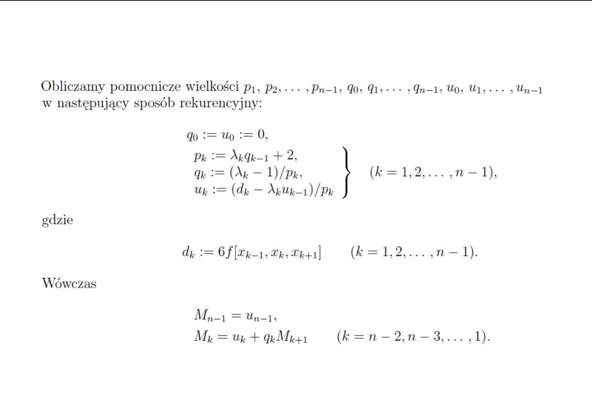
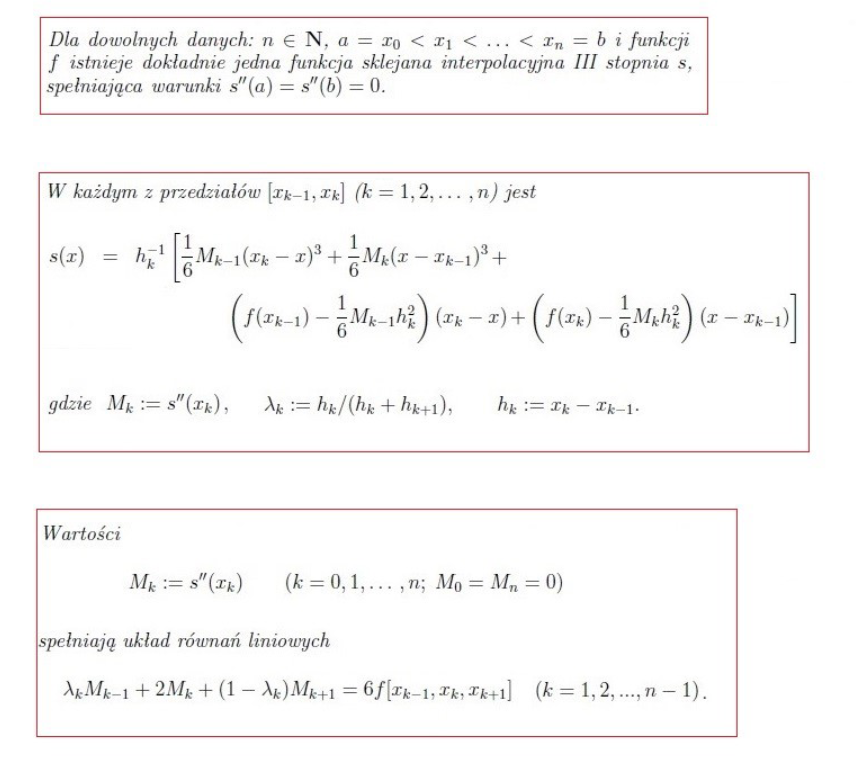

**Description:**
A program that enables users to generate cubic splines for a given image by interactively selecting points on the graphical user interface (GUI). The GUI allows users to pick points on the image, and the program then generates cubic splines based on these points.
**Modifications**
By default the image is with the text "Numerki są super :-\)" Although it can changed in **Settings.py** as well as the line thickness and color of each cubic spline. By default different cubic splines are of different colours
##### How to use it?
You would have to run PlottingGraphGUI.py
```
python3 PlottingGraphGUI.py
```
Before that make sure to install all the modules needed
```
pip install numpy pillow matplotlib
```
* After picking points for a cubic spline, click **Add Spline** to save it. Cubic spline that was created from those points will appear down the screen.
Now you can again pick points for separate spline.
* If you are done with your image, click **Quit** button. All the points for each spline and the result image would be saved in **data** folder
##### Mathematical background
What formulas and algorithms were used:


